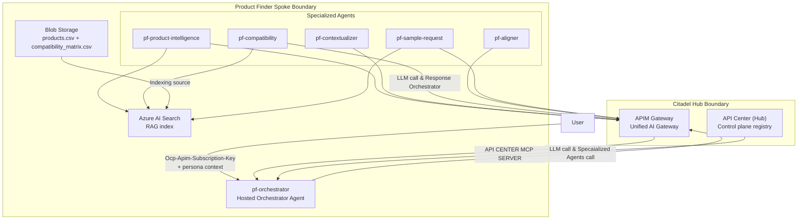

# Product Finder Hub-Spoke Diagram

This diagram shows the Product Finder request path and governance boundaries.

## Reading Guide

- Hub boundary: APIM enforces policy and acts as the mandatory gateway for traffic.
- Spoke boundary: orchestrator and specialists execute the Product Finder use case logic.
- API Center appears in both boundaries to show governance publication and consumption points.
- Data flow: Blob stores source CSV data; Azure AI Search serves runtime retrieval for specialists.
- Runtime pattern: orchestrator routes to specialists and returns a bundled answer through APIM.
